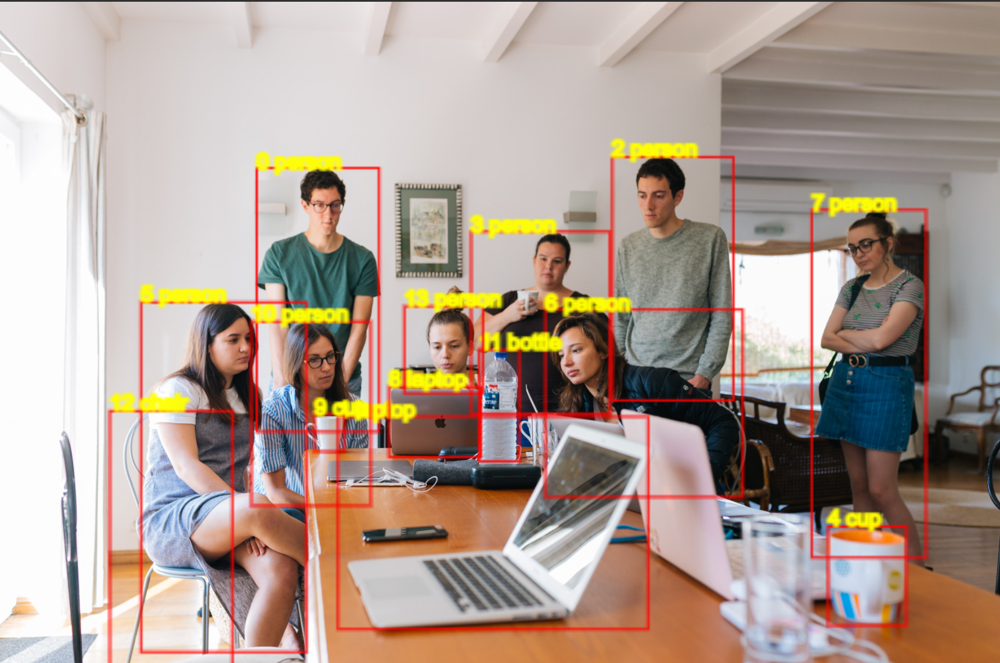
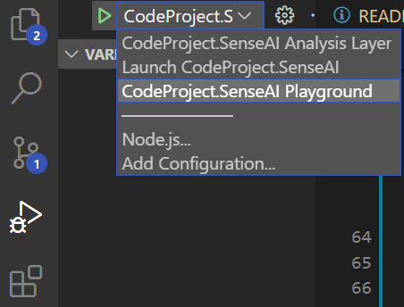
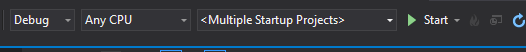

[](https://open.vscode.dev/codeproject/CodeProject.SenseAI) [](https://www.python.org/) [](https://www.mongodb.com/licensing/server-side-public-license) [](https://github.com/ellerbrock/open-source-badges/)

# CodeProject SenseAI Server

A standalone, self-hosted, fast, free and Open Source Artificial Intelligence microserver for any 
platform, any language. It can be installed locally, required no off-device or out of network data
transfer, and is easy to use.

# Why

1. AI programming is something every single developer should be aware of. We wanted a fun project we could use to help teach developers and get them involved in AI. We'll be using SenseAI as a focus for articles and exploration to make it fun and painless to learn AI programming.

3. We got sick of fighting versions and libraries and models and being blocked by tiny annoying things every step of the way. So we put put this together so we could save you the frustation. We'll take care of the housekeeping, you focus on the code.
  
2. We also got sick of needing to sign up to potentially expensive services for AI functionality. This  is something we need, and by sharing maybe you can use it too, and hopefully add your own modules and improvements along the way.

## Cut to the chase: how do I play with it?



#### 1: Running and playing with the features

1. [**Download the latest version**](https://www.codeproject.com/ai/sense/latest.aspx), install, and launch the shortcut to the server's dashboard on your desktop.
2. On the dashboard, at the bottom, is a link to the demo playground. Open that and play!

#### 2: Running and debugging the code

1. Clone the CodeProject SenseAI reposotory.
2. Make sure you have Visual Studio Code or Visual Studio 2019+ installed.
3. Run the setup script in /Installers/Dev
4. Debug the front-end server application (see notes below, but it's easy)


## How do I use it in my application?

Here's an example of using the API for scene detection using a simple JavaScript call:

```html
<html>
<body>
Detect the scene in this file: <input id="image" type="file" />
<input type="button" value="Detect Scene" onclick="detectScene(image)" />

<script>
function detectScene(fileChooser) {
    var formData = new FormData();
    formData.append('image', fileChooser.files[0]);

    fetch('http://localhost:5000/v1/vision/detect/scene', {
        method: "POST",
        body: formData
    })
    .then(response => {
        if (response.ok) response.json().then(data => {
            console.log(`Scene is ${data.label}, ${data.confidence} confidence`)
        });
    });
}
</script>
</body>
</html>
```

You can include the CodeProject SenseAI installer (or just a link to the latest version of the installer) in your own apps and installers and voila, you have an AI enabled app.


## What does it include?

CodeProject SenseAI includes

1. **A HTTP REST API Server.** The server listens for requests from other apps, passes them to the backend analysis services for processing, and then passes the results back to the caller. It runs as a simple self contained web service on your device.
2. **Backend Analysis services**.  The brains of the operation is in the analysis services sitting behind the front end API. All processing of data is done on the current machine. No calls to the cloud and no data leaving the device.
3. **The Source Code**, naturally.

## Supported platforms

 - Windowws
 - Linux (Ubuntu)
 - macOS
 - Docker

## What can it do?

It can detect stuff!

CodeProject SenseAI can currently

- Detect objects in images
- Detect faces in images
- Detect the type of scene represented in an image
- Recognise faces that have been registered with the service
- Pick out the most relevant sentences from text to generate a summary

We will be constantly expanding the feature list.

## Our Goals

1. **To promote AI development** and inspire the AI developer community to dive in and have a go. AI is here, it's in demand, and it's a huge paradigm change in the industry. Whether you like AI or not, developers owe it to themselves to experiment in and familiarise themselves with the  technology. This is CodeProject SenseAI: a demonstration, a playground, a learning tool, and a library and service that can be used out of the box.
2. **To make AI development *easy***. It's not that AI development is that hard. It's that there are so, so many options. Our architecture is designed to allow any AI implementation to find a home in our system, and for our service to be callable from any language.
3. **To focus on core use-cases**. We're deliberately not a solution for everyone. Instead we're a solution for common day-to-day needs. We will be adding dozens of modules and scores of AI capabilities to our system, but our goal is always clarity and simplicity over a 100% solution.
4. **To tap the expertise of the Developer Community**. We're not experts but we know a developer or two out there who are. The true power of CodeProject SenseAI comes from the contributions and improvements from our AI community.

## How to download and install CodeProject.SenseAI

#### Supported Environments

This is a Beta release and so support is constrained solely to Windows 10+, 64bit, using CPU acceleration. Future releases will include other Operating Systems as well as GPU support.

### Installing CodeProject.SenseAI

#### Windows

To **install CodeProject.SenseAI** as a standalone service ready for integration with applications such as HomeAssist or BlueIris, download the [latest installation package](https://www.codeproject.com/ai/sense/latest.aspx).

Double click the installer. This will install the server as a Windows Service. SenseAI Server and the backend analysis services will now be running, and will automatically restart each time your machine is restarted.

To **explore CodeProject.SenseAI** Click on the SensaAI playground link on the server dashboard. The server will, of course, need to be running for this test application to function. Sample images can be found in the <code>TestData</code> folder under the <code>C:\Program Files\CodeProject\SenseAI</code> folder

#### Docker

##### For Windows

```
docker run -p 5000:5000 --name SenseAI-Server -d -v c:\ProgramData\CodeProject\SenseAI:/usr/share/CodeProject/SenseAI codeproject/senseai-server
```

##### For Linux

```
docker run -p 5000:5000 --name SenseAI-Server -d -v /usr/share/CodeProject/SenseAI:/usr/share/CodeProject/SenseAI codeproject/senseai-server 
```

##### For macOS, choose a port other than 5000:

```
docker run -p 5500:5000 --name SenseAI-Server -d -v /usr/share/CodeProject/SenseAI:/usr/share/CodeProject/SenseAI codeproject/senseai-server
```

For Docker, please visit http://localhost:5000/testdata.zip (after launching SenseAI server) to download some test images for use with the SenseAI playground

### Setting up the development environment

If you wish to debug or make enhancements to the code then you should install:

 1. **Visual Studio Code** or **Visual Studio 2019+**. [VS Code](https://code.visualstudio.com/download) is available on Windows, macOS and Linux. Visual Studio is available on Windows and macOS. We've tested against both, but not against other IDEs at this point

 2. **Python**. You may add Python support either via the Visual Studio Installer, through Visual Code Extensions, or by [downloading python directly](https://www.python.org/downloads/). However, this is not needed since Python will be installed automatically as part of the development environment setup script.

 3. **.NET 6 SDK** Download the [.NET SDK 6 here](https://dotnet.microsoft.com/download/dotnet/6.0). 

 4. For the **(Optional) WIX installers** we do all our work within Visual Studio. For this you will need to 
    a. Extensions -> Manage Extensions, search for Wix and install Wix toolset Visual Studio 2019 Extension
    b. Download the Wix Toolset Build tools by heading to the [download page](https://wixtoolset.org/releases/), clicking the download link, and then download the .exe installer from the GitHub page you're directed to. The [current version](https://github.com/wixtoolset/wix3/releases/download/wix3112rtm/wix311.exe) is 3.11.
    c. Ensure you have .NET 3.5.1 (that's not a typo) installed. See the **/Installers/Windows/.NET 3.5.1** directory for a link to the installer download.

    You do not need to install support for creating the installers for general development. 

#### Platform Specific

1. For **Windows** simply ensure the .NET 6 SDK is installed.

2. For **Ubuntu** 21.10, 21.04 (inc. LTS), 18.04 (LTS) first install the .NET 6 packages
    ```bash   
    wget https://packages.microsoft.com/config/ubuntu/<UBUNTU-VERSION-HERE>/packages-microsoft-prod.deb -O packages-microsoft-prod.deb
    sudo dpkg -i packages-microsoft-prod.deb
    rm packages-microsoft-prod.deb
    ```

    where &lt;UBUNTU-VERSION-HERE> is the version of Ubuntu (use `lbs_release -d` to find your current version). **Note** that for Ubuntu 21.10 you should use 21.04 due to the 21.10 packages not yet being available.

    To install the .NET 6 SDK on Ubuntu run

    ```bash
    sudo apt-get update; \
    sudo apt-get install -y apt-transport-https && \
    sudo apt-get update && \
    sudo apt-get install -y dotnet-sdk-6.0 
    ```

    See [Install the .NET SDK or the .NET Runtime on Ubuntu](https://docs.microsoft.com/en-us/dotnet/core/install/linux-ubuntu) for more information.
 
3. For **macOS** just use the [standalone .NET SDK installers](https://dotnet.microsoft.com/en-us/download/dotnet/6.0)

#### If you are using VS Code

You'll need the following extensions

1. [Python extension for Visual Studio Code](https://marketplace.visualstudio.com/items?itemName=ms-python.python)

2. [C# extension for Visual Studio Code](https://marketplace.visualstudio.com/items?itemName=ms-dotnettools.csharp).


##### If you are using VS Code on WSL (Windows Subsystem for Linux)

1. You will need to install the [C# Extension](https://marketplace.visualstudio.com/items?itemName=ms-dotnettools.csharp) for WSL, even if you've already installed it for Windows. 
    
    Load up the SenseAI project in VS Code within Ubuntu by navigating to the SenseAI root folder in a Ubuntu window and typing "`code .`". Then head to the [C# Extension page](https://marketplace.visualstudio.com/items?itemName=ms-dotnettools.csharp), choose install, and the extension should be installed. If you get a warning that there is an instance of VS Code already running, close VS code and hit the install button again.

2. Also install the [Remote WSL Extension](https://marketplace.visualstudio.com/items?itemName=ms-vscode-remote.remote-wsl) for Visual Studio Code.

### To build and run:

1. Clone the [CodeProject.SenseAI repository](https://github.com/codeproject/CodeProject.SenseAI.git) from GitHub

2. run `/installers/Dev/setup_dev_env_win.bat` (for windows) or `sudo bash setup_dev_env_linux.sh` (for Ubuntu or macOS). This will download required assets and setup the Python environment.


#### If you are using VS Code

1. Open the main application folder in VS Code

2. Click the "Run and Debug" button on the left hand tab bar (the arrow)

3. From the dropdown at the top of the window, select **Launch CodeProject.SenseAI**


4. CLick the green arrow next to the dropdown

The dashboard webpage should launch after the code has built and the server has started.


#### If you are using Visual Studio

1. You may wish to have the Python workflow enabled in Visual Studio. While not critical, it does help with debugging.

2. Open the solution in Visual Studio and build the entire solution

3. To run the Server and the demo application in DEBUG you can either

    1. Start both the projects in debug mode by 
        1. In Solution Explorer, open demos / .NET and right-click on CodeProject.SenseAI.Playground and choose Debug -> Start new instance.
        2. In Solution Explorer, open src / API / Server and right-click on FrontEnd and choose Debug -> Start new instance. 
         
    2. Configure Visual Studio to start multiple projects by
        1. In Solution Explorer, right-click on the solution and select **Set Startup Projects...** and configure Multiple startup projects as shown below.
          

    3. Now when you start with or without debugging, both the Server and demo projects with start.  Also, this will be  shown on the toolbar as shown below.  
       

4. In Solution Explorer, open src / AnalysisLayer. Right click on DeepStack and choose <code>Open Folder in File Explorer</code>. Double click on the start.bat script.  This script will ensure that the Python virtual environment is enabled and environment variables set.  

#### It's running!

At this point the Playground application should be indicting it has a connection to the API server, and the server should be dispatching requests to the backend Analysis layer.

#### Common Errors

**YOLO ONNX models not found**

When building you see:
```text
error MSB3030: Could not copy the file "<path>\CodeProject.SenseAI.AnalysisLayer.Yolo\assets\yolov5m.onnx" because it was not found.
```
Ensure you've run the development setup scripts before attempting to build

**Server startup failed**

```
System.ComponentModel.Win32Exception (2): The system cannot find the file specified.
   at System.Diagnostics.Process.StartWithCreateProcess(ProcessStartInfo startInfo)
```

Ensure you've run the development setup scripts before attempting to start the server

**Port already in use**

If you see:
```
Unable to start Kestrel.
System.IO.IOException: Failed to bind to address http://127.0.0.1:5000: address already in use.
```
Either you have CodeProject.SenseAI already running, or another application is using port 5000. Either shut down any application using port 5000, or change the port CodeProject.SenseAI uses. You can change the external port that CodeProject.SenseAI uses by editing the <code>appsettings.json</code> file and changing the value of the <code>PORT</code> variable. In the demo app there is a Port setting you will need to edit to match the new port.

## Roadmap

The following features will be added over the coming weeks and months

1. Better Linux / macOS development environment support
2. Docker images
2. A GUI management system
3. GPU support
4. More analysis services
