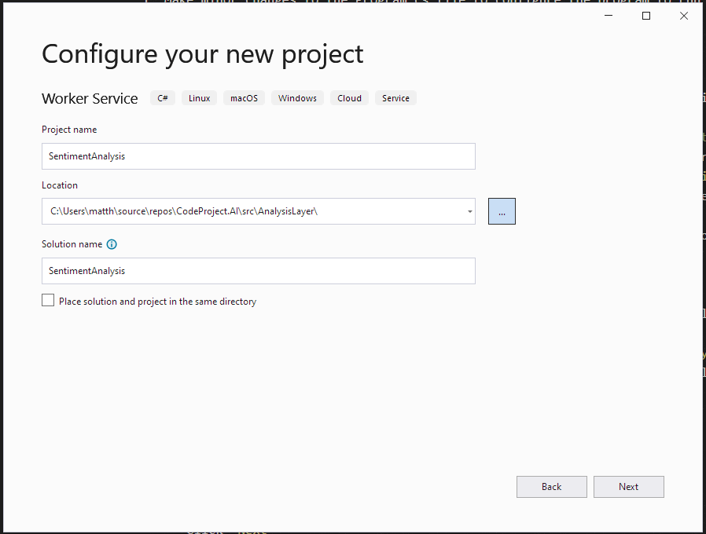
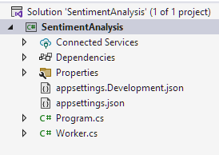

## Introduction
As we dog food the **CodeProject SenseAI Server** and Modules we look for ways to improve the experience for Module developers. While working on a Module for doing Sentiment Analyis in NET6, we realized that there was a lot of boiler plate code that could be moved to the SenseAI Module NET SDK. Doing so would:

- reduce the amount and complexity of code required to create a module
- improve error handling and general reliablity
- improve maintainability of the code by reducing duplicate code
- decouple the module code from most changes in the implementation of the SDK

This has reduced the size of the code you need to write to wrap some existing code or sample from 240+ complex lines to 65 lines of code with the hardest code, the code to get the parameters and process the data, looking something like
```csharp
/// <summary>
/// The work happens here.
/// </summary>
/// <param name="request">The request.</param>
/// <returns>The response.</returns>
public override BackendResponseBase ProcessRequest(BackendRequest request)
{
    string text = request.payload.GetValue("text");
    if (text is null)
        return new BackendErrorResponse(-1, $"{ModuleName} missing 'text' parameter.");

    var result = _textClassifier.PredictSentiment(text);

    if (result is null)
        return new BackendErrorResponse(-1, $"{ModuleName} PredictSentiment returned null.");

    var response = new SentimentAnalysisResponse
    {
        is_positive          = result?.Prediction?[1] > 0.5f,
        positive_probability = result?.Prediction?[1]
    };

    return response;
}
```

This article will discuss how to use the updated **SenseAI Module NET SDK** to create a Module for the **CodeProjectSenseAI Server** from an existing online sample's code. We hope that this may inspire you to develop and share Modules that provide other interesting functionality.

This article is focused on the process of creating a Module, not how the details of the operation of the **CodeProject SenseAI Server** or the Sentiment Analysis code. These details can be found in the reference documents and code. The code for this article can be found in the `src/AnalysisLayer/SentimentAnlysis` directory of the CodeProject SenseAI GitHub repository (TODO: Create Link).

This article builds on the concepts found in previous articles:

* <a href="https://www.codeproject.com/ai/Senseai/devguide/module_examples/adding_new_modules.html" target="_blank">Adding new modules to SenseAI</a>
* <a href="https://www.codeproject.com/ai/Senseai/devguide/module_examples/add_python_module.html" target="_blank">Adding your own Python module</a>
* <a href="https://www.codeproject.com/ai/Senseai/devguide/module_examples/add_net_module.html" target="_blank">Adding you own .NET module</a>. 

## Developing the Module
This tutorial assumes that you have already cloned the **CodeProject SenseAI** repository from GitHub. This is located at <a href="https://github.com/codeproject/CodeProject.SenseAI" target="_blank">https://github.com/codeproject/CodeProject.SenseAI</a>.

After dertermining that you want to add some functionality to the **CodeProject SenseAI Server** so that you use it in your other projects and applications the steps for creating a the required Module are:

1. Locate code or library that be dropped in or easily modified to perform the processing you require. Samples tend to require some refactoring to make useable in a general solution, while library code and be dropped in, or incorporated as a NuGet package.
1. Create a Module project in the CodeProject SenseAI solution.  
1. Create a modulesettings.json file to configure the endpoint that will be exposed by the CodeProject SenseAI Server for this Module. The **CodeProject SenseAI Server** will discover this file on startup, configure the defined endpoints, and start the module's executable.
1. Reference the NuGet package(s), or copy the code from the repo, that provide the required functionality.
1. If required, refactor the copied code for general use.  
1. Derive a class to process the requests receive from the SenseAI Server and return the response. You will derive from an abstract base class and only have to provide a method that processes the request. All the boilerplate Server/Module communication and error handling is taken care of for you.
1. Make minor changes to the `Program.cs` file to configure the program to run the above code.
1. Test. This can be done by using tools such as Postman or writing a simple web page to call the new endpoint on the **CodeProject SenseAI Server**.

### Locate code or library to use
Having determined that Sentiment Analysis of comments and messages is something we wish to evaluate for our website, we found a tutorial <a href="https://docs.microsoft.com/en-us/dotnet/machine-learning/tutorials/text-classification-tf" target="_blank">Analyze sentiment of movie reviews using a pre-trained TensorFlow model in ML.NET</a> with code for doing just that in the <a href="https://github.com/dotnet/samples/tree/main/machine-learning/tutorials/TextClassificationTF" target="_blank">TextClassificationTF</a> sample in the <a href="https://github.com/dotnet/samples" target="_blank">DotNet Samples</a> repository.

### Create Module Project
When you write a SenseAI Module in NET 6, you are creating something that polls the CodeProject SenseAI Server for commands from a queue created for the module. The easiest way to do this is to create a **Worker Service** project in a folder under the `src/AnalysisLayer`. The **CodeProject SenseAI Server** scans the directories in this folder for Module metadata which allows the server to start the Modules.

The steps to do this are:

- Right click on the **src/AnalyisLayer** folder in the Solution Explorer
    - Select `Add` -> `New Project`
    - Select the **Worker Service** project template for C#
    - Click `Next`
- This will open the `Project Configuration` dialog  

    - Set the `Project Name` to **SentimentAnalysis**
    - Set the `Location` to the **src\AnalysisLayer** directory in your copy of the CodeProject SenseAI solution.
    - click `Next`. 
- This will open the `Additional Information` dialog  


    - We don't need to change anything here, so click `Create`. This will create the project with the following structure  



### Create modulesettings.json files
The `modulesettings.json` files configure the Module for
- whether it should be started
- how to start it
- what platforms it runs on
- the endpoint(s) that will be exposed by the CodeProject SenseAI Server for this Module.  In this case we will be 
    - exposing `http://localhost:5000/v1/txt/sentiment`
    - using a the HTTP POST method
    - sending one form variable `text` that will contain the text to be analyzed
    - and expect a JSON payload reponse with
        - a boolean `success` property indicating if the operation was successfully completed
        - a boolean `is_positive` property indicating if the input text had a positive sentiment
        - a float `positive_probability` of the probablity the input text had a positive sentiment where 0.5 is neutral.

#### modulesettings.json
This file contains the configuration shared by all platforms and environments and implements the above requirements.
```json
{
  // The processes (typically the backend analysis processes) that are to be started when the
  // server starts. They will be started in order of appearance.
  "Modules": {
    "SentimentAnalysis": {
      "Name": "Sentiment Analysis",
      "Activate": true,
      "Description": "Determines if a comment is positive or negative",
      "FilePath": "SentimentAnalysis\\SentimentAnalysis.dll",
      "Runtime": "dotnet",
      "Platforms": [ "windows", "linux", "docker" ],
      "RouteMaps": [
        {
          "Name": "Sentiment Analysis",
          "Path": "text/sentiment",
          "Method": "POST",
          "Queue": "sentimentanalysis_queue",
          "Command": "sentiment",
          "Description": "Determines if the supplied text has a positive or negative sentiment",
          "Inputs": [
            {
              "Name": "text",
              "Type": "Text",
              "Description": "The text to be analyzed."
            }
          ],
          "Outputs": [
            {
              "Name": "success",
              "Type": "Boolean",
              "Description": "True if successful."
            },
            {
              "Name": "is_positive",
              "Type": "Boolean",
              "Description": "Whether the input text had a positive sentiment."
            },
            {
              "Name": "positive_probability",
              "Type": "Float",
              "Description": "The probability the input text has a positive sentiment."
            }
          ]
        }
      ]
    }
  }
}
```

#### modulesettings.development.json
This file overrides some of the `modulesettings.json` file values for the Development environment. In this case, the location of the executable will be found in the `bin\debug\net6.0` directory rather than the Module's root folder
```json
{
  "Modules": {
    "SentimentAnalysis": {
      "FilePath": "SentimentAnalysis\\bin\\debug\\net6.0\\SentimentAnalysis.dll"
    }
  }
}
```

### Copy code and assets from repo
The data and models uses by the sentiment analyis code are contained in the `sentiment_model` folder of the sample's repo. Copy this folder to the new module project.

The code to use the data and modules is all contained in the `Program.cs` file of the sample code. To copy over this code
- create a new class file `TextClassifier.cs`
- replace the contents of the `TextClassifier` class in this file with the contents of the `Program` class in the `Program.cs` file of the sample code. We will fix this up in the next step

### Refactor Sample code for general use
The code from the sample code is intended as a specific example with hard-coded inputs and lots of `Console.WriteLine` statements to show lots of details of the operation of the code. We updated the code by
- turning the main() method into the class constructor TextClassifier
- making some variables into fields
- changing the PredictSentiment method to take parameters instead of using hard-coded values.
As the actual details of the changes are not what we are trying to accomplish with the articles, the code is not shown here. The results of these changes can be seen in the code in the repository.

### Include additional NuGet and Project dependencies
In order to build this project, there are a few dependencies that must be included:
- NuGet Packages that are required to use Microsoft's ML.NET framework and its support for TensorFlow models.
    - `Microsoft.ML`
    - `Microsoft.ML.SampleUtils`
    - `Microsoft.ML.TensorFlow`
    - `SciScharp.TensorFlow.Redist`
- Projects to use the SenseAI NET SDK
    - `CodeProject.SenseAI.AnalsisLayer.SDK`

### Create the Request Processor class
The next to last coding step is to create the background worker that will retreive requests from the CodeProject SenseAI Server, process the request, and return the result. With the updated SDK, most of this has been encapsulated in an abstract class `CommandQueueWorker`. All we have to do is create a new class file `SentimentAnalysisWorker.cs` and in this file
- create a response class `SentimentAnalysisResponse`, derived from `BackendSuccessResponse` which defines the structure of the modules response.
- override the `SentimentAnalysisWorker.ProcessRequest` method and 
- create the `SentimentAnalysisWorker` constructor to initialize the functionality specific to the Module.
The completed SentimentAnalysisWorker.cs file is
```csharp
using CodeProject.SenseAI.AnalysisLayer.SDK;

namespace SentimentAnalysis
{
    class SentimentAnalysisResponse : BackendSuccessResponse
    {
        /// <summary>
        /// Gets or set a value indicating whether the text is positive.
        /// </summary>
        public bool? is_positive { get; set; }

        /// <summary>
        /// Gets or sets the probablity of being positive.
        /// </summary>
        public float? positive_probability { get; set; }
    }

    public class SentimentAnalysisWorker : CommandQueueWorker
    {
        private const string _defaultModuleId  = "sentiment-analysis";
        private const string _defaultQueueName = "sentimentanalysis_queue";
        private const string _moduleName       = "Sentiment Analysis";

        private readonly TextClassifier _textClassifier;

        /// <summary>
        /// Initializes a new instance of the SentimentAnalysisWorker.
        /// </summary>
        /// <param name="logger">The Logger.</param>
        /// <param name="textClassifier">The TextClassifier.</param>
        /// <param name="configuration">The app configuration values.</param>
        public SentimentAnalysisWorker(ILogger<SentimentAnalysisWorker> logger,
                                       TextClassifier textClassifier,  
                                       IConfiguration configuration)
            : base(logger, configuration, _moduleName, _defaultQueueName, _defaultModuleId)
        {
            _textClassifier  = textClassifier;
        }

        /// <summary>
        /// The work happens here.
        /// </summary>
        /// <param name="request">The request.</param>
        /// <returns>The response.</returns>
        public override BackendResponseBase ProcessRequest(BackendRequest request)
        {
            string text = request.payload.GetValue("text");
            if (text is null)
                return new BackendErrorResponse(-1, $"{ModuleName} missing 'text' parameter.");

            var result = _textClassifier.PredictSentiment(text);

            if (result is null)
                return new BackendErrorResponse(-1, $"{ModuleName} PredictSentiment returned null.");

            var response = new SentimentAnalysisResponse
            {
                is_positive          = result?.Prediction?[1] > 0.5f,
                positive_probability = result?.Prediction?[1]
            };

            return response;
        }
    }
}
```

### Hook it all up
Hooking everything together trivial.  In the Program.cs file 
- Change the line   
`services.AddHostedService<Worker>();`   
to  
`services.AddHostedService<SentimentAnalysisWorker>();`
- Add TextClassifier to the DI container by adding the line  
services.AddSingleton<TextClassifier>();  
just before the previously line.
The file should look like
```csharp
using SentimentAnalysis;

IHost host = Host.CreateDefaultBuilder(args)
    .ConfigureServices(services =>
    {
        services.AddSingleton<TextClassifier>();
        services.AddHostedService<SentimentAnalysisWorker>();
    })
    .Build();

await host.RunAsync();
```

You will want to make the SentimentAnalysis a Build Dependency of the Frontend projects so that it is built when the **CodeProject SenseAI Server** is built.

### Test it.
To test this, I created a simple `test.html` page that takes some text, sends it to the **CodeProject SenseAI Server**, and handles and displays the result. Is's as bare bones as I could make it to show how easy it is to use the new feature.

```html
<!DOCTYPE html>
<html lang="en" xmlns="http://www.w3.org/1999/xhtml">
<head>
    <meta charset="utf-8" />
    <title>Sentiment Analysis Module Test</title>
    <script type="text/javascript">

        function doAnalysis(textToSend) {
            var formData = new FormData();
            formData.append('text', textToSend);
            fetch('http://localhost:5000/v1/text/sentiment', {
                    method: 'POST',
                    body: formData,
                    cache: "no-cache"
                })
                .then(response => {
                    if (!response.ok) {
                        result.innerText = `Http error! Status : ${response.status}`;
                    }
                    return response.json().then(data => {
                        var resultHTML = data.is_positive
                                ? `<p>The text sentiment was positive with a probablity of ${data.positive_probability}</p>`
                                : `<p>The text sentiment was negative with a probablity of ${1.0 - data.positive_probability}</p>`;
                        result.innerHTML = resultHTML;
                    });
                });
        }
    </script>
</head>
<body>
    <h1>Sentiment Analysis Module Test</h1>
    <form method="post" action="" enctype="multipart/form-data" id="myform">
        <div>
            <label for="textToAnalyze">Text to analyze:</label>
            <div>
                <textarea id="textToAnalyze" name="textToAnalyze" rows="8" cols="80" style="border:solid thin black"></textarea>
            </div>        
        </div>
        <div>
            <button type="button" onclick="doAnalysis(textToAnalyze.value)">Submit</button>
        </div>
        <br />
        <div>
            <label for="result">Result</label>
            <div id="result" name="result" style="border:solid thin black"></div>
        </div>
    </form>
</body>
</html>
```

To see this in action, run the `Frontend` project (SenseAI Server) in the Debugger in Debug configuration and then open the `test.html` file in the browser of choice. Copy some text into the text box and press submit. I used text from an Amazon review. You should see something similar to this:


## Call to action
