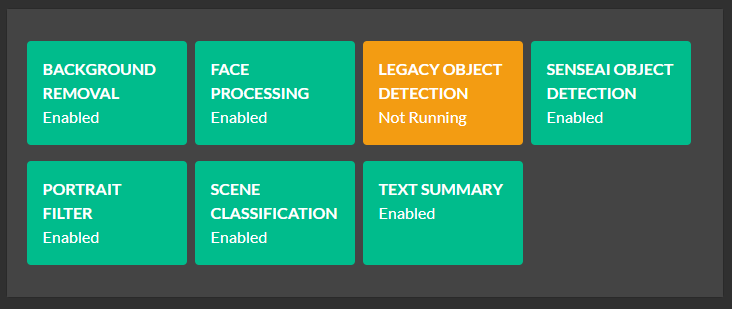
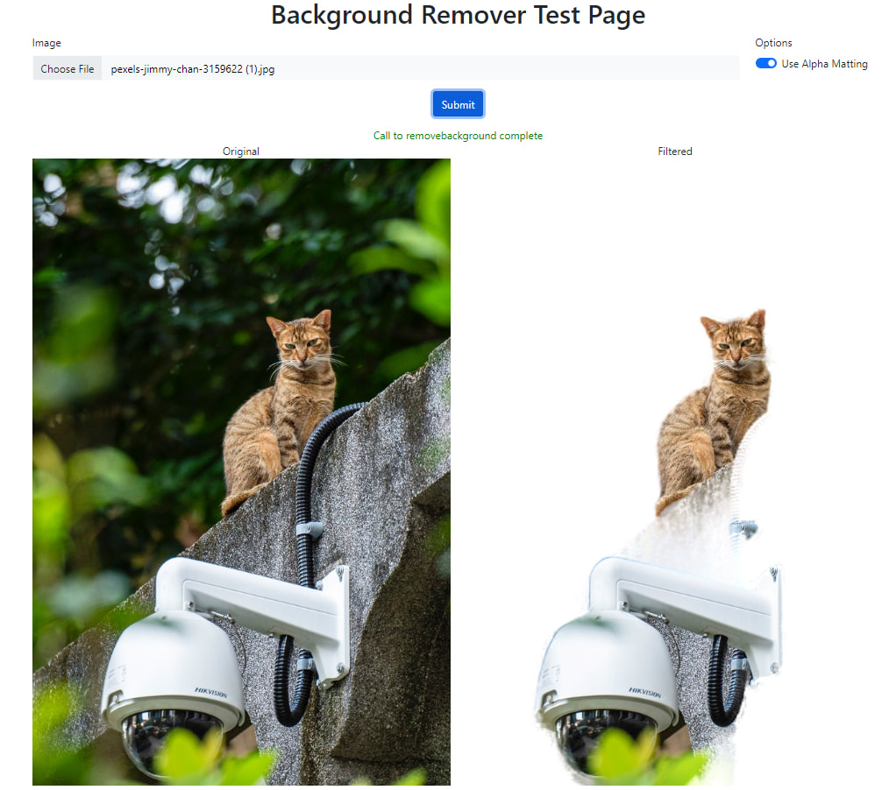

## Introduction

Adding AI capabilities to an app is reasonably straight forward if you're happy 
to follow the twisty turny maze that is the endless list of libraries, tools, 
interpreters, package managers and all the other fun stuff that sometimes makes coding 
about as fun as doing the dishes.

We built SenseAI to hide all the annoying things from developers and leave them
with a simple AI package that Does Stuff and is easy to use with an existing application.

If SenseAI doesn't do what you need then it's easy to add modules that will fill
in the gap.


## The SenseAI architecture in under 30 seconds

SenseAI is an HTTP based REST API server. It's basically just a webserver that
your application sends requests. Those requests are placed on a queue, and the
analysis services (aka The Modules) pick request off the queues they know how to
service. Each request is then processed (an AI operation is performed based on the
request) and the results are sent back to the API server, which in turn sends it back
to the application that made the initial call.

           request  |--------------------------------------|      |---------------------------------|
    |-----|  --->   | [API Server] ---> Queue1 (eg images) | Json | Module 1 (eg object detection)  |
    | App |         |              ---> Queue2 (eg sounds) | <--> | Module 2 (eg voice recognition) |
    |-----|  <---   |              ---> Queue2 (eg text)   |      | Module 3 (eg song recognition)  |
           response |--------------------------------------|      |---------------------------------|


1. An application sends a request to the API server
2. The API server places the request on the appropriate queue
3. The backend modules poll the queue they are interested in, grab a request and process it
4. The backend module then sends the result back to the API server
5. The API Server then sends the result back to the calling application

The Sense API Server runs independently of the calling application. 

> Think of SenseAI like a database server or any other service you have running in the background: 
> it runs as a service or daemon, you send it commands and it responds with results. You don't 
> sweat the details of how it goes about its business, you just focus on your application's core 
> business.

## Adding a new module to SenseAI

There are 2 tasks in adding a new module

1. Ensuring any prerequisites such as models, libraries or interpreters are installed correctly
2. Writing the actual module and wiring it up to SenseAI

### Adding prerequisites

Prerequisites such as models, interpreters, compilers and tools will need to be added to the dev
setup script in order to allow everyone working on the code to have a dev environment that works
for that module. If you choose to include your module in a Windows installer or Docker image, then
you will need to update both of those environements as well.

#### Required (for development)

2. **The Dev Environment setup script**. In /Installers/Dev are the setup scripts that should be
   run in order to setup the dev environment for build, debug and testing. If you need to download
   and/or install models, programs or tools ensure you add the commands to these scripts.

   There are two scripts, one for Windows and one for Linux/macOS. The scripts are broken into sections,
   including general setup, reusable functions, and blocks of script relevant to each given module.

#### Optional (for the end users)

1. **The Windows installer**. If you wish to have your new module be installed on Windows with the 
   exsiting modules you will need to create a sub-installer for any assets that need to be put
   in place. This is non-trivial and only required if you wish to distribute your work as part of
   the main installer.

   In the future, a module's assets will simply be zipped together with a manifest file which the
   installer will inspect and install in the correct locations automatically.

3. **The Docker Image**  If you wish to have your new module be installed in the Docker image you 
   will need to update the main Docker image to ensure it includes the assets and tools you need.

Both of these are outside the scope of this article

### Writing a module

Writing a module is the fun part. In fact you often don't have to write a new module: there are
hundreds of excellent Open Source, self-contained AI projects that would make excellent modules.
All you need to do is ensure the module can run in the installed environent (taken care of in
the pre-requisites step), that any models it needs are downloaded and in the right place (again,
should already be done), and that the module can communicate with the SenseAI server.

We will be providing a simple SDK for many languages that will help allow you to write a shim that
will fit between the module and SenseAI and take care of communication.

## Let's add a module

We're going to add the [remgb](https://github.com/danielgatis/rembg) module. This
is a simple but fun AI module that takes any phote containing a subject and removes
the background from the image. It runs under Python 3.9 or above.

### Setup (the installer)

the rembg module comprises the following

1. The python code
1. The python 3.9 interpreter
1. Some Python packages
1. The AI models

To ensure these are all in place within the development environment we need to modify the setup
scripts in /Installers/Dev.

#### For Windows (setup_dev_env_win.bat)

``` batch
:: Background Remover :::::::::::::::::::::::::::::::::::::::::::::::::::::::::

:: The name of the dir containing the Background Remover module
set moduleDir=BackgroundRemover

:: The full path of the background remover module
set modulePath=%analysisLayerPath%\%moduleDir%

:: The name of the dir containing the background remover models
set moduleAssetsDir=models

:: The name of the file in our S3 bucket containing the assets required for this module
set modelsAssetFilename=rembg-models.zip

:: Install python and the required dependencies
call :SetupPython 3.9
call :InstallPythonPackages 3.9 "%modulePath%\requirements.txt" "onnxruntime"

:: Download the AI models
call :Download "%storageUrl%" "%downloadPath%\" "%modelsAssetFilename%" "%moduleDir%" ^
               "Downloading Background Remover models..."

:: Copy over the models to the working directory for this module.
if exist "%downloadPath%\%modulesDir%" (
    robocopy /e "%downloadPath%\%moduleDir% " "%modulePath%\%moduleAssetsDir% "
)
```

The code should be self-explanatory:

1. Setup the names of the directories and subdirectories that will hold the module, as well as the
   name of the asset to be downloaded.

   **analysisLayerPath** is the full path to the Analysis folder that contains all modules. In our
   case this is currently /src/AnalysisLayer

2. Install Python 3.9 and then install the Python packages as listed in the requirements.txt file

   **:SetupPython** is a subroutine that installs the given version of Python. We only support 3.7
   and 3.9 at present, but are adding more as needed. All that's really needed to add another version
   is to provide a self-contained download of a 64-it python interpreter.

   **:InstallPythonPackages** walks through the supplied requirements file and installs the packages
   using the given python version. There is a second parameter (here, 'onnxruntime') that allows
   you to provide the name of a package which, if detected, can be assumed to mean that all packages
   have been installed and that this step can be skipped. This provides an optimisation in case
   you need to rerun the installation.

3. Download the models

   **:Download** *source_base_url* *download_storage_path* *archive_filename* *extract_dir* *message* 
   will download *archive_filename* from the *source_base_url*, store it in *download_storage_path* 
   and extract it into a directory called *extract_dir*. It will also output *message* when and if 
   the download starts. *archive_filename* must be either a Zip or GZip file.

   **source_base_url** contains the URL to our S3 bucket that holds all our downloads.<br>
   **download_storage_path** will be /Installers/Dev/downloads.<br>
   **archive_filename** will, in this case, be 'rembg-models.zip'<br>
   **extract_dir** is 'BackgroundRemover'

   So we're downloading the models in *rembg-models.zip* from our S3 bucket and storing it in 
   */Installers/Dev/downloads/BackgroundRemover*. 

   The reason we store the zip's in the /downloads dir instead of extracting directly to the module's
   directory is so we can easily re-run the setup script without needing to re-download every asset
   of every module.


4. Copy over the downloaded model to the module's working directory. Nothing too fancy here. The
   models will be copied to *%modulePath%\%moduleAssetsDir%* which expands to
   */src/AnalysisLayer/BackgroundRemover/models*.

#### For Linux

The script is essentially the same as the Windows version:

``` bash
# Background Remover :::::::::::::::::::::::::::::::::::::::::::::::::::::::::

# The name of the dir containing the background remover module
moduleDir='BackgroundRemover'

# The name of the dir containing the background remover models
modulePath="${analysisLayerPath}/${moduleDir}"

# The name of the dir containing the background remover models
moduleAssetsDir='models'

# The name of the file in our S3 bucket containing the assets required for this module
modelsAssetFilename='rembg-models.zip'

setupPython 3.9
installPythonPackages 3.9 "${modulePath}/requirements.txt" "onnxruntime"

Download $storageUrl "${downloadPath}" $modelsAssetFilename "${moduleDir}" "Downloading models..."
if [ -d "${downloadPath}/${moduleDir}" ]; then
    mv -f "${downloadPath}/${moduleDir}" "${modulePath}/${moduleAssetsDir}"
fi
```
   
Note that in our scripts we've included some small additions to allow you to force a re-download
if needed, but these are just details and so we've not included them here in order to keep things
simple.

### The Module's API

We should start with how we'll call the module. It can be whatever we like, so let's choose the 
route <code>/v1/image/removebackground</code>. We'll pass in an image and a boolean "use_alphamatting"
which tells the code whether or not to use alpha matting (better for fuzzy edges).

The return package will include a single item "imageBase64", which contains the base64 encoded 
version of the image with background removed.

### The Module's Source Code

First, we create a folder under the modules directory and copy over the
code for the module. In this case we'll store the code in /src/AnalysisLayer/BackgroundRemover.
For convenience we'll create a Python project for those using Visual Studio (working in VS Code is 
just as simple)

The rembg module has one main method we need to call, named <code>remove</code>. We need to be able
to get the data from a client's request to this method, and then pass the results of this method
back to the client. For this, we'll use the <code>AnalysisLayer/SDK/senseAI.py</code> module to
help.

We'll also create an adapter (which we'll call sense_rembg_adapter.py) for rembg that connects the
rembg remove method with our senseAI.py helper module.

```python
# Import the SenseAI helper
import sys
sys.path.append("../SDK/Python")
from senseAI import SenseAIBackend, LogMethod

# Import the rembg method we need to call
from rembg.bg import remove

# Import the packages that we need to pass around the data
import base64
from io import BytesIO
import json
import traceback

# Create a SenseAI helper
senseAI = SenseAIBackend()

# The main method containing the loop that will process the queue
def remove_background(thread_name):

    QUEUE_NAME = "removebackground_queue"

    # Keep checking the queue 
    while True:

        # Get a request from the API server queue.
        queue_entries: [] = senseAI.getCommand(QUEUE_NAME)

        if len(queue_entries) > 0:
            for queue_entry in queue_entries: 

                # Get the data from the request
                req_data: dict = json.JSONDecoder().decode(queue_entry)

                output: any = {}
                try:
                    # Get the request ID so we can include it in the data we return to the server
                    req_id: str = req_data.get("reqid", "")

                    # Use the senseAI helper methods to get the image data and alpha matting param
                    img = senseAI.getImageFromRequest(req_data, 0)
                    use_alphamatting: bool = bool(senseAI.getRequestValue(req_data, "use_alphamatting", "false"))

                    # Perform the operation
                    processed = remove(img, use_alphamatting)

                    # Convert the result of the operation into data that can be passed back as Json
                    buffered = BytesIO()
                    processed.save(buffered, format="PNG")
                    img_dataB64_bytes = base64.b64encode(buffered.getvalue())
                    img_dataB64 = img_dataB64_bytes.decode("ascii");

                    # The return object. This can be whatever you like, as long as the client knows
                    output = {"success": True, "imageBase64": img_dataB64}

                except Exception:
                    err_trace = traceback.format_exc()

                    output = {
                        "success": False,
                        "error": "unable to process the image", 
                        "code": 500
                    }

                    # Use the senseAI helper to report the error
                    senseAI.log(LogMethod.Error | LogMethod.Cloud | LogMethod.Server,
                               { "process": "removebackground",
                                 "file": "sense_rembg_adapter.py",
                                 "method": "remove_background",
                                 "message": err_trace,
                                 "exception_type": "Exception"})

                finally:
                    try:
                        # Send the response back to the server, who will in turn send
                        # it back to the client
                        senseAI.sendResponse(req_id, json.dumps(output))
                    except Exception:
                        print("An exception occured")


if __name__ == "__main__":
    senseAI.log(LogMethod.Info | LogMethod.Server, {"message":"RemoveBackground module started."})
    remove_background("main_removebackground")
```

This is the only code we've added. The rembg module has been copied and pasted as-is, and we're
reusing the senseAI.py helper class. Nothing else (code-wise) needs to be added.

### The modulesettings.json file

This file, in the BackgroundRemover folder, instructs the API server in how to 
launch our new analysis service.

```json
{
    "Modules": {

        "EnvironmentVariables": {
            "U2NET_HOME": "%MODULES_PATH%/BackgroundRemover/models" // where to store the models
        },

        // The processes (typically the backend analysis processes) that are to be started when the
        // server starts. They will be started in order of appearance.
        "ModulesConfig": {

            "BackgroundRemoval": {
                "Name": "Background Removal",
                "Activate": true,
                "Description": "Removes backgrounds from images.",
                "FilePath": "BackgroundRemover\\sense_rembg_adapter.py",
                "Platforms": [ "windows", "linux", "macos", "docker" ],
                "Runtime":  "python39",

                "RouteMaps": [
                    // ... (explained below)
                ]
            }
        }
    }
}
```

The **EnvironmentVariables** section defines key/value pairs that will be used to set environment
variables that may be reqiured by the module. In this case, the path to the AI model files. This
is a value specific to, and defined by, the rembg module.

MODULES_PATH is a macro that will expand to the location of the directory containing the modules.
In this case /src/AnalysisLayer.

The **ModulesConfig** section contains the information on launching the module. 
The name and description are self-explanatry. The FilePath is the path to the file to be
executed, relative to the MODULES_PATH directory. Activate sets whether or not this module will
be launched at runtime.

Runtime defines what runtime will launch the file. We currently support dotnet (.NET), python37
(python 3.7) and python39 (Python 3.9). If omitted, the SenseAI Server will attempt to
guess based on the FilePath.

The Platforms array contains an entry for each platform on which the service can run.
Currently Windows, Linux, macOS and Docker are supported.

The file also defines the API routes for the module under the **RouteMaps** section

```json
{
  "Modules": {
    "ModulesConfig": {
      "BackgroundRemoval": {
         "Name": "Background Removal",
         "Description": "Removes backgrounds from images.",

         ...

         "RouteMaps": [
           {
             "Path": "image/removebackground",
             "Command": "removebackground",
             "Queue": "removebackground_queue",
             "Description": "Removes the background from images.",
             "Inputs": [ ... ],
             "Outputs": [...]
           }
         ]
       }
     }
   }
}
```

Path is the API path, in this case _localhost:5000/v1/image/removebackground_. Remember that this
was what we chose (arbitrarily) as our API. It can be anything as long as it isn't currently in use.

Command is the method in the API controller that will be called, in this case 
<code>removebackground</code>. Queue is the name of the queue in the API server that will manage 
the request for this service.

In the adapter python module we wrote we had the code
```python
 QUEUE_NAME = "removebackground_queue"
 ```
 Queue, in the route map, should match this name.

 Description, Inputs and Outputs are purely documentation at this stage.

 ### The client that will call our new module

 A simple Javascript test harness can be used to demonstrate the new module

 ```javascript
  // Assume we have a HTML INPUT type=file control with ID=fileChooser
  var formData = new FormData();
  formData.append('image', fileChooser.files[0]);
  formData.append("use_alphamatting", 'false');

  var url = 'http://localhost:5000/v1/image/removebackground';

  fetch(url, { method: "POST", body: formData})
        .then(response => {
            if (response.ok) {
                response.json().then(data => {
                    // img is an IMG tag that will display the result
                    img.src = "data:image/png;base64," + data.imageBase64;
                })
            }
        })
```
The project contains a file `test.html` that implements this, providing the UI to collect the 
information and display the results.

 ## Install and test

 At this point we have a module, an install script and a test client. Let's give
 it a run

 0. Ensure you have the latest [SenseAI repo](https://github.com/codeproject/CodeProject.SenseAI)
 downloaded. That has all the code we've talked about above already in place

 1. Run the dev install script. This will ensure Python 3.9 is installed and
 setup, and that the required Python modules are installed.

 2. Launch the server by starting a new debug session in Visual Studio or VS Code.
 
 3. In Debug, the SenseAI Dashboard is automatically launched when run. After the server starts all
 the backend Modules, including the Background Removal module, the Dashboard will display the
 modules it knows about.  


 4. Launch the `index.html` file in a browser, choose a file and click "Submit" button. The results
 should be shown.  


 ## What next?

 That's up to you. We've demonstrated a very simple AI module that removes the background from an image. The main work was
 
 1. Ensuring you have the assets (eg models) available on a server so they can be downloaded
 2. Updating the install script so your assets can be downloaded abd moved into place, as well as
    ensuring you have the necessary runtime and libraries installed
 3. Dropping in your module's code and writing an adapter so it can talk to the SenseAI Server
 4. Writing a modulesettings file that describes the API for your module
 5. Testing! Always the fun part.

 The possibilities on what you can add are almost limitless. Our goal is to enable you, as a 
 developer, to add your own AI modules easily, and in turn get the benefit of modules that others
 have added. Mix and match, play with different sets of trained modules, experiment with settings
 and see where you can take this.

 It's about learning and it's about having some fun. Go for it.