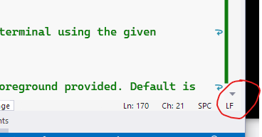

## 'command not found' during development setup on Linux/macOS

When running the setup script (or any script, for that matter) on Linux or macOS, you see an error
of the form:

``` text title=''
: No such file or directory 1: #1/bin/bash
: No such file or directory 10: ./utils.sh
setup_dev_env_linux.sh: line 11: $'\r': command not found
```
This indicates that the .sh script file has been saved with Windows-style CRLF line endings instead
of Linux/Unix style LF line endings.

Open the script in Visual Studio or Visual Studio Code and at the bottom right of the editor window
you will see a line ending hint



Click that and choose 'LF' to correct the line endings and re-run the script.

## YOLO ONNX models not found

When building you see:
```text title=''
error MSB3030: Could not copy the file 
  "<path>\CodeProject.AI.AnalysisLayer.Yolo\assets\yolov5m.onnx"
  because it was not found.
```
Ensure you've run the development setup scripts before attempting to build

## Server startup failed

```text title=''
System.ComponentModel.Win32Exception: The system cannot find the file specified.
   at System.Diagnostics.Process.StartWithCreateProcess(ProcessStartInfo startInfo)
```

Ensure you've run the development setup scripts before attempting to start the server

## Port already in use

If you see:
```text title=''
Unable to start Kestrel.
System.IO.IOException: Failed to bind to address http://127.0.0.1:5000: address 
   already in use.
```
Either you have CodeProject.AI already running, or another application is using port 5000.

Shut down any application using port 5000, or change the port CodeProject.AI uses. You can 
change the external port that CodeProject.AI uses by editing the <i>appsettings.json</i> file 
and changing the value of the <code>PORT</code> variable. In the demo app there is a Port setting 
you will need to edit to match the new port.
