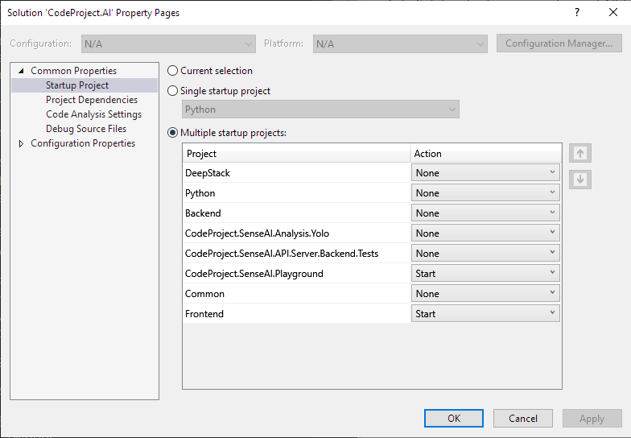

{width="30" .middle} Windows &nbsp;
{width="30" .middle} macOS &nbsp;
{width="30" .middle} macOS Mx &nbsp;
{width="30" .middle} Ubuntu &nbsp;
{width="30" .middle} Docker &nbsp;
{width="30" .middle} Visual Studio &nbsp;
{width="30" .middle} VS Code


# Setting up the Development Environment

A quick guide to setting you up for Debugging, testing and adding your own additions to CodeProject.AI.

This current release works in Visual Studio Code on Windows 10+. Ubuntu and macOS (both Intel and 
Apple Silicon), and Visual Studio 2019+ on Windows 10+. We currently only provide CPU support, but 
future releases will include GPU support.


<center>

[Download the Latest version](https://www.codeproject.com/ai/latest.aspx){ .md-button .md-button--primary }
&nbsp; &nbsp; &nbsp;
[Fork on GitHub](https://github.com/codeproject/CodeProject.AI-Server.git){ .md-button  }

</center>


## Install the Prerequisites

If you wish to debug or make enhancements to the code then you should install:

 1. **Visual Studio Code** or **Visual Studio 2019+**. [VS Code](https://code.visualstudio.com/download) is available on Windows, macOS and Linux. Visual Studio is available on Windows and macOS. We've tested against both, but not against other IDEs at this point

 2. **Python**. (Optional) You may add Python support either via the Visual Studio Installer, through Visual Code Extensions, or by [downloading python directly](https://www.python.org/downloads/). However, this is not needed since Python will be installed automatically as part of the development environment setup script.

 3. **Install the .NET 6 SDK** . 

    === "Windows"

        Download the [.NET SDK 6 here](https://dotnet.microsoft.com/download/dotnet/6.0) and install

    === "Ubuntu"

        For **Ubuntu** 21.10, 21.04 (inc. LTS), 18.04 (LTS) first install the .NET 6 packages

        ``` bash   
        wget https://packages.microsoft.com/config/ubuntu/<UBUNTU-VERSION-HERE>/packages-microsoft-prod.deb -O packages-microsoft-prod.deb
        sudo dpkg -i packages-microsoft-prod.deb
        rm packages-microsoft-prod.deb
        ```

        where &lt;UBUNTU-VERSION-HERE> is the version of Ubuntu (use `lbs_release -d` to find your current version). **Note** that for Ubuntu 21.10 you should use 21.04 due to the 21.10 packages not yet being available.

        To install the .NET 6 SDK on Ubuntu run

        ``` bash
        sudo apt-get update; \
        sudo apt-get install -y apt-transport-https && \
        sudo apt-get update && \
        sudo apt-get install -y dotnet-sdk-6.0 
        ```

        See [Install the .NET SDK or the .NET Runtime on Ubuntu](https://docs.microsoft.com/en-us/dotnet/core/install/linux-ubuntu) for more information.
 
    === "macOS"

        Download the [standalone .NET SDK installers](https://dotnet.microsoft.com/en-us/download/dotnet/6.0)
        and install


 4. For the (Optional) **Windows-only WIX installers** we do all our work within Visual Studio. For this: 

    1. Go to Extensions -> Manage Extensions in Visual Studio, search for Wix and install Wix toolset Visual Studio 2019 Extension
    2. Download the Wix Toolset Build tools by heading to the [download page](https://wixtoolset.org/releases/), clicking the download link, and then download the .exe installer from the GitHub page you're directed to. The [current version](https://github.com/wixtoolset/wix3/releases/download/wix3112rtm/wix311.exe) is 3.11.
    3. Ensure you have .NET 3.5.1 (that's not a typo) installed. See the `/Installers/Windows/.NET 3.5.1` directory for a link to the installer download.

    You do not need to install support for creating the installers for general development. 

## Download and Setup the code:

1. Clone the [CodeProject.AI repository](https://github.com/codeproject/CodeProject.AI-Server.git) from GitHub

2. In the Solution folder go to /Installers/Dev and run the installation scripts:
    1. For Windows: `setup_dev_env_win.bat` 
    2. For Ubuntu: `sudo bash setup_dev_env_linux.sh`
    3. For macOS: `bash setup_dev_env_linux.sh`
    
    This will download required assets and setup the runtime environments.

## Development using Visual Studio Code

You'll need the following extensions

1. [Python extension for Visual Studio Code](https://marketplace.visualstudio.com/items?itemName=ms-python.python)

2. [C# extension for Visual Studio Code](https://marketplace.visualstudio.com/items?itemName=ms-dotnettools.csharp).


### To Build and Debug

1. Open the main application folder in VS Code

2. Click the "Run and Debug" button on the left hand tab bar (the arrow)

3. From the dropdown at the top of the window, select **Launch CodeProject.AI** (Win or Linux)

    {width="400"}

4. Click the green arrow next to the dropdown

The dashboard webpage should launch after the code has built and the server has started.

### Using the Windows Subsystem for Linux?

The Windows Subsystem for Linux (WSL) may first need to be installed on your Windows machine. 
Installing is as simple as opening a Powershell terminal and entering

```powershell
wsl --install
```

More information can be found in [Microsoft's guide](https://docs.microsoft.com/en-us/windows/wsl/install). 

You will also need to install Visual Studio Code for Ubuntu. The downloads for each platform are at
[Visual Studio Code Download page](https://code.visualstudio.com/download). For WSL select Ubuntu, 64 bit 
(under "Debian, Ubuntu" select '64 bit')

Once you have WSL and VS Code installed, you will also need to install the following VS code extensions:

1. The [Remote WSL Extension](https://marketplace.visualstudio.com/items?itemName=ms-vscode-remote.remote-wsl).

2. The [C# Extension](https://marketplace.visualstudio.com/items?itemName=ms-dotnettools.csharp) 
   for WSL, even if you've already installed it for Windows.
   
    Open an Ubuntu Terminal (we strongly recommend [Windows Terminal](https://apps.microsoft.com/store/detail/windows-terminal/9N0DX20HK701?hl=en-us) for this) and type `code .`. Then head to the
    [C# Extension page](https://marketplace.visualstudio.com/items?itemName=ms-dotnettools.csharp), 
    choose install, and the extension should be installed. If you get a warning that there is an 
    instance of VS Code already running, close VS code and hit the install button again.

Finally, you will need to install .NET 6 for Ubuntu. Follow the "Install the .NET 6 SDK" 
instructions for Ubuntu in the "Install the Prerequisites" section above.

You're now ready to edit and Debug CodeProject.AI inside WSL using VS Code. For this demo we will use **the
same solution files we use in Windows.** Editing and debugging the *same* files in Windows and in Linux 
makes life easy. Just be careful of those CRLF vs LF line endings.

1. Navigate to your repo and launch VS Code. If your solution is in 
  `C:\Dev\CodeProject\CodeProject.AI` then you would use

    ``` shell
    cd /mnt/c/Dev/CodeProject/CodeProject.AI
    code .
    ```

2. **Re**-open in WSL by hitting <kbd>Ctrl+Shift P</kbd> for the command pallete, select "Remote-WSL: Reopen Folder in WSL" and hit enter.

You are now coding against the existing Windows repository, but using a remote connection to the WSL system from within VS Code. From within this current environment it's all Linux. Run the setup scripts (the
Linux version) and you're on your way.

## Development using Visual Studio 2019 or later

1. Open the solution in Visual Studio and build the entire solution
2. Start a new instance of the `/src/API/Server/Frontend` project

The dashboard should appear and you're on your way.

You may wish to have the Python workflow enabled in Visual Studio. While not critical, it does 
help with debugging.

### To run and debug the Server and the demo .NET application 

There are two ways you can do this:

1. Separately start both the projects in debug mode: 

    1. In Solution Explorer, open demos / .NET and right-click on `CodeProject.AI.Explorer` and choose Debug -> Start new instance.
    2. In Solution Explorer, open src / API / Server and right-click on `FrontEnd` and choose Debug -> Start new instance. 
         
2. Configure Visual Studio to start multiple projects:

    1. In Solution Explorer, right-click on the solution and select **Set Startup Projects...**. 
       The Solution property page will appear
   
          

    2. Check "Multiple Startup Projects" and select the Frontend API server and the 
       `CodeProject.AI.Explorer` projects.

    Now when you start with or without debugging, both the Server and demo projects with start.
