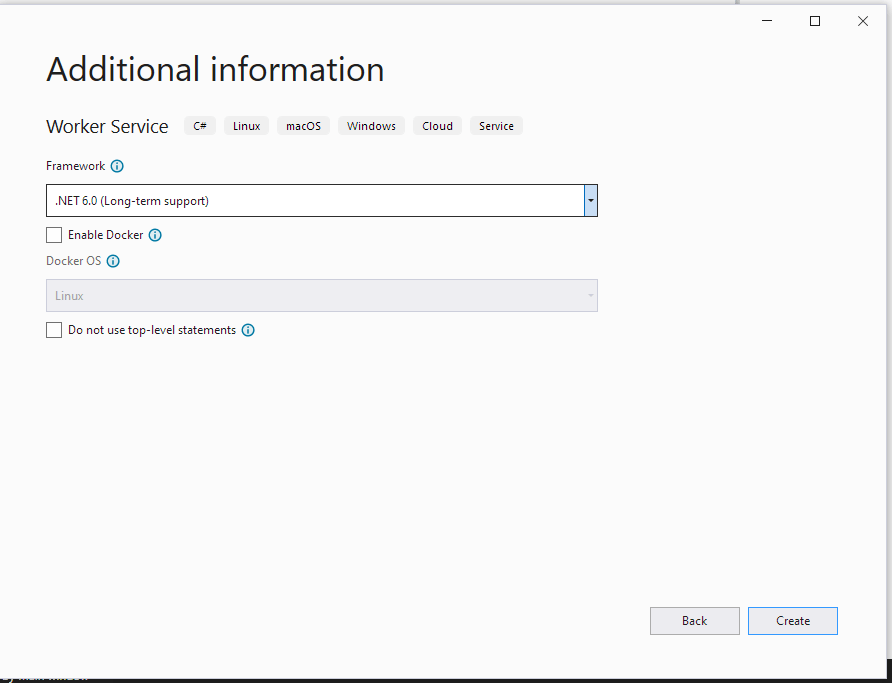

## Introduction

This article will show how to create a Module in .NET for the CodeProject.AI Server by adapting
existing code and adding an adapter. This will enable the functionality of the original code to be
exposed as an HTTP endpoint by the CodeProject.AI Server. The process is similar to
[Adding your own Python module to CodeProject.AI](add_python_module.md), except we'll be using
.NET instead of Python.

Again: ensure you've read [Adding new modules to CodeProject.AI](adding_new_modules.md) before you
start.


## Choosing a module

You can write your own module from scratch, or use one of the large number of Open Source AI projects currently available. There are thousands out there and for this article I chose the
[TextClassificationTF](https://github.com/dotnet/samples/tree/main/machine-learning/tutorials/TextClassificationTF) sample in the [DotNet Samples](https://github.com/dotnet/samples) repository. This project takes some text and returns whether the text has a positive or negative sentiment.

## Adding the Module to CodeProject.AI

First, make sure you've cloned (or downloaded) the [CodeProject.AI code](https://github.com/codeproject/CodeProject.AI-Server) from GitHub. 

To add our chosen module to CodeProject.AI we will need to do the following (we'll go through each
step in detail in a moment):

1. Create a new project in the CodeProject.AI solution to hold our module.

2. Create a modulesettings.json file in the project to configure the endpoint that will be exposed by the CodeProject.AI Server for this Module. The **CodeProject.AI Server** will discover this file on startup, configure the defined endpoints, and start the module's executable.

3. Copy over the code from the module you wish to add into the Project you just created.
   For neatness it can be preferable to create a sub-folder in the Project that houses the
   entire code from the other module.

   **The Goal is to ensure it's easy to include updates**. The code you use will no 
   doubt be updated over time. It's nice to be able to take the updated code and just
   drop it into the same sub-folder. Instant upgrade. Give or take a little plumbing.

4. Add references to any NuGet packages the original code referenced.

5. If required, refactor the copied code for general use. This is usually needed because many
  pieces of code you might find might have hardwired values or locations, may be designed to
  be called as an API, or as a command line, or be in a web application's controller somewhere
  deep. 

    You may need to make some (hopefully) minor changes to expose a function that your adapter
  can call, or replace hardwired values with values provided through environment variables.
  Again: the less changes you need to make the better, but some may be unavoidable.

6. Create a CodeProject.AI adapter by deriving a class to process the requests receive from the CodeProject.AI Server and return the response. You will derive from an abstract base class and only have to provide a method that processes the request. All the boilerplate Server/Module communication and error handling is taken care of for you.

7. Make minor changes to the project's `Program.cs` file to configure the program to run the above code.

8. Test. This can be done by using tools such as Postman or writing a simple web page to call the new endpoint on the **CodeProject.AI Server**.


### Create the Module's Project

When you write a CodeProject.AI Module in NET 6, you are creating something that polls the CodeProject.AI Server for commands from a queue created for the module. The easiest way to do this is to create a **Worker Service** project in a folder under the `src/AnalysisLayer`. The **CodeProject.AI Server** scans the directories in this folder for Module metadata which allows the server to start the Modules.

The steps to do this are:

- Right click on the **src/AnalyisLayer** folder in the Solution Explorer

    - Select `Add` -> `New Project`
    - Select the **Worker Service** project template for C#
    - Click `Next`

  This will open the `Project Configuration` dialog  
 
   

   - Set the `Project Name` to **SentimentAnalysis**
   - Set the `Location` to the **src\AnalysisLayer** directory in your copy of the 
     CodeProject.AI solution.
   - click `Next`. 

  This will open the `Additional Information` dialog  

   

   We don't need to change anything here, so click `Create`. This will create the project with the following structure  

   

### Create the modulesettings.json file

The `modulesettings.json` files configures the Module for

- whether it should be started
- how to start it
- what platforms it runs on
- the endpoint(s) that will be exposed by the CodeProject.AI Server for this Module.  In this case we will be 
    - exposing `http://localhost:5000/v1/text/sentiment`
    - using a the HTTP POST method
    - sending one form variable `text` that will contain the text to be analyzed
    - and expect a JSON payload response with
        - a Boolean `success` property indicating if the operation was successfully completed
        - a Boolean `is_positive` property indicating if the input text had a positive sentiment
        - a float `positive_probability` of the probability the input text had a positive sentiment where 0.5 is neutral.

In our case the `modulesettings.json` file will look like this

```json
{
  "Modules": {
    "SentimentAnalysis": {
      "Name": "Sentiment Analysis",
      "Activate": true,
      "Description": "Determines if a comment is positive or negative",
      "FilePath": "SentimentAnalysis\\SentimentAnalysis.dll",
      "Runtime": "dotnet",
      "Platforms": [ "windows", "linux", "docker" ],
      "RouteMaps": [
        {
          "Name": "Sentiment Analysis",
          "Path": "text/sentiment",
          "Method": "POST",
          "Queue": "sentimentanalysis_queue",
          "Command": "sentiment",
          "Description": "Determines if the supplied text has a positive or negative sentiment",
          "Inputs": [
            {
              "Name": "text",
              "Type": "Text",
              "Description": "The text to be analyzed."
            }
          ],
          "Outputs": [
            {
              "Name": "success",
              "Type": "Boolean",
              "Description": "True if successful."
            },
            {
              "Name": "is_positive",
              "Type": "Boolean",
              "Description": "Whether the input text had a positive sentiment."
            },
            {
              "Name": "positive_probability",
              "Type": "Float",
              "Description": "The probability the input text has a positive sentiment."
            }
          ]
        }
      ]
    }
  }
}
```

#### modulesettings.development.json

This file overrides some of the `modulesettings.json` file values for the Development environment. In this case, the location of the executable will be found in the `bin\debug\net6.0` directory rather than the Module's root folder

```json
{
  "Modules": {
    "SentimentAnalysis": {
      "FilePath": "SentimentAnalysis\\bin\\debug\\net6.0\\SentimentAnalysis.dll"
    }
  }
}
```

### Copy code and assets from the sample code

The data and models uses by the sentiment analysis code are contained in the `sentiment_model` folder of the sample's repository. Copy this folder to the new module project.

The code to use the data and modules is all contained in the `Program.cs` file of the sample code. To copy over this code

- create a new class file `TextClassifier.cs`
- replace the contents of the `TextClassifier` class in this file with the contents of the `Program` class in the `Program.cs` file of the sample code. We will fix this up in the next step

### Include additional NuGet and Project dependencies

In order to build this project, there are a few dependencies that must be included:

- NuGet Packages that are required to use Microsoft's ML.NET framework and its support for TensorFlow models.
    - `Microsoft.ML`
    - `Microsoft.ML.SampleUtils`
    - `Microsoft.ML.TensorFlow`
    - `SciScharp.TensorFlow.Redist`
- Projects to use the CodeProject.AI NET SDK
    - `CodeProject.AI.AnalsisLayer.SDK`

### Refactor the sample code for our use

The code from the sample code is intended as a specific example with hard-coded inputs and lots of `Console.WriteLine` statements to show lots of details of the operation of the code. We updated the code by

- turning the main() method into the class constructor TextClassifier
- making some variables into fields
- changing the PredictSentiment method to take parameters instead of using hard-coded values.

As the actual details of the changes are not what we are trying to accomplish with this article, the code is not shown here. The results of these changes can be seen in the code in the repository.

### Create the Request Processor class

The next to last coding step is to create the background worker that will retrieve requests from the CodeProject.AI Server, process the request, and return the result. With the updated SDK, most of this has been encapsulated in an abstract class `CommandQueueWorker`. All we have to do is create a new class file `SentimentAnalysisWorker.cs` and in this file

- create a response class `SentimentAnalysisResponse`, derived from `BackendSuccessResponse` which defines the structure of the modules response.
- override the `SentimentAnalysisWorker.ProcessRequest` method and 
- create the `SentimentAnalysisWorker` constructor to initialize the functionality specific to the Module.

The completed SentimentAnalysisWorker.cs file is

```csharp
using CodeProject.AI.AnalysisLayer.SDK;

namespace SentimentAnalysis
{
    class SentimentAnalysisResponse : BackendSuccessResponse
    {
        /// <summary>
        /// Gets or set a value indicating whether the text is positive.
        /// </summary>
        public bool? is_positive { get; set; }

        /// <summary>
        /// Gets or sets the probablity of being positive.
        /// </summary>
        public float? positive_probability { get; set; }
    }

    public class SentimentAnalysisWorker : CommandQueueWorker
    {
        private const string _defaultModuleId  = "sentiment-analysis";
        private const string _defaultQueueName = "sentimentanalysis_queue";
        private const string _moduleName       = "Sentiment Analysis";

        private readonly TextClassifier _textClassifier;

        /// <summary>
        /// Initializes a new instance of the SentimentAnalysisWorker.
        /// </summary>
        /// <param name="logger">The Logger.</param>
        /// <param name="textClassifier">The TextClassifier.</param>
        /// <param name="configuration">The app configuration values.</param>
        public SentimentAnalysisWorker(ILogger<SentimentAnalysisWorker> logger,
                                       TextClassifier textClassifier,  
                                       IConfiguration configuration)
            : base(logger, configuration, _moduleName, _defaultQueueName, _defaultModuleId)
        {
            _textClassifier  = textClassifier;
        }

        /// <summary>
        /// The work happens here.
        /// </summary>
        /// <param name="request">The request.</param>
        /// <returns>The response.</returns>
        public override BackendResponseBase ProcessRequest(BackendRequest request)
        {
            string text = request.payload.GetValue("text");
            if (text is null)
                return new BackendErrorResponse(-1, $"{ModuleName} missing 'text' parameter.");

            var result = _textClassifier.PredictSentiment(text);

            if (result is null)
                return new BackendErrorResponse(-1, $"{ModuleName} PredictSentiment returned null.");

            var response = new SentimentAnalysisResponse
            {
                is_positive          = result?.Prediction?[1] > 0.5f,
                positive_probability = result?.Prediction?[1]
            };

            return response;
        }
    }
}
```

### Hook it all up
Hooking everything together trivial.  In the Program.cs file 

- Change the line   
  ```csharp
  services.AddHostedService<Worker>();
  ```  
  to  
  ```csharp
  services.AddHostedService<SentimentAnalysisWorker>();
  ```
- Add TextClassifier to the DI container by adding the line  
   ```csharp
   services.AddSingleton<TextClassifier>();
   ```
   just before the previously line. The file should look like
   ```csharp
   using SentimentAnalysis;

   IHost host = Host.CreateDefaultBuilder(args)
       .ConfigureServices(services =>
       {
           services.AddSingleton<TextClassifier>();
           services.AddHostedService<SentimentAnalysisWorker>();
       })
       .Build();

   await host.RunAsync();
   ```

You will want to make the SentimentAnalysis a Build Dependency of the Frontend projects so that it is built when the **CodeProject.AI Server** is built.

### Test it.
To test this, I created a simple `test.html` page that takes some text, sends it to the
**CodeProject.AI Server**, and handles and displays the result. It's as bare bones as I could make
it to show how easy it is to use the new feature.

```html
<!DOCTYPE html>
<html lang="en" xmlns="http://www.w3.org/1999/xhtml">
<head>
    <meta charset="utf-8" />
    <title>Sentiment Analysis Module Test</title>
    <script type="text/javascript">

        function doAnalysis(textToSend) {
            var formData = new FormData();
            formData.append('text', textToSend);
            fetch('http://localhost:5000/v1/text/sentiment', {
                    method: 'POST',
                    body: formData,
                    cache: "no-cache"
                })
                .then(response => {
                    if (!response.ok) {
                        result.innerText = `Http error! Status : ${response.status}`;
                    }
                    return response.json().then(data => {
                        var resultHTML = data.is_positive
                                ? `<p>The text sentiment was positive with a probablity of ${data.positive_probability}</p>`
                                : `<p>The text sentiment was negative with a probablity of ${1.0 - data.positive_probability}</p>`;
                        result.innerHTML = resultHTML;
                    });
                });
        }
    </script>
</head>
<body>
    <h1>Sentiment Analysis Module Test</h1>
    <form method="post" action="" enctype="multipart/form-data" id="myform">
        <div>
            <label for="textToAnalyze">Text to analyze:</label>
            <div>
                <textarea id="textToAnalyze" name="textToAnalyze" rows="8" cols="80" style="border:solid thin black"></textarea>
            </div>        
        </div>
        <div>
            <button type="button" onclick="doAnalysis(textToAnalyze.value)">Submit</button>
        </div>
        <br />
        <div>
            <label for="result">Result</label>
            <div id="result" name="result" style="border:solid thin black"></div>
        </div>
    </form>
</body>
</html>
```

To see this in action, run the `Frontend` project (CodeProject.AI Server) in the Debugger in Debug configuration and then open the `test.html` file in the browser of choice. Copy some text into the text box and press submit. I used text from an Amazon review. You should see something similar to this:


## Added Bonus - XCOPY deploy Module on Windows.

NET 6 modules do not depend on the installation of any runtimes or the setup of virtual 
environments the same way Python modules are. The NET 6 runtime is already installed by the 
**CodeProject.AI Server** installer. Because of this, the Release version of the build can be bin
deployed into an existing Windows installation of the **CodeProject.AI Server**. The steps to
do this are:

  - Build the module project in `Release` mode.
  - Create a folder in the `c:\Program Files\CodeProject\AI\AnalysisLayer` directory. This directory should have the same name as the FilePath's directory in the `modulesettings.json` file. For this example that would be "SentimentAnalysis".
  - Copy the contents of the project's bin\Release\net6.0 directory to the directory created in the previous step.
  - Using the `Service` app, restart the **CodeProject.AI Server** service. The new module will now be expose on the endpoint defined in the modulesettings.json file.

## Summing up

Adding a new module to CodeProject.AI is generally not that difficult. You need to

  1. Choose a module that is self contained and can expose functionality as a method call.
  2. Create a project in the AnalysisServices folder to house your projects, and copy over the code
  3. Create an adapter that will interface between the CodeProject.AI server and your code
  4. Ensure you have the models and dependencies in place
  5. Create a modulesettings.json file to describe to the server how to start the module
  6. Make any minor changes needed to the module you're adding to allow it to function with
     your adapter and modify the Program.cs file to get things rolling

Your module is now part of your CodeProject.AI ecosystem and any clients that make use of the 
server can now access your new module seamlessly. Congratulations!