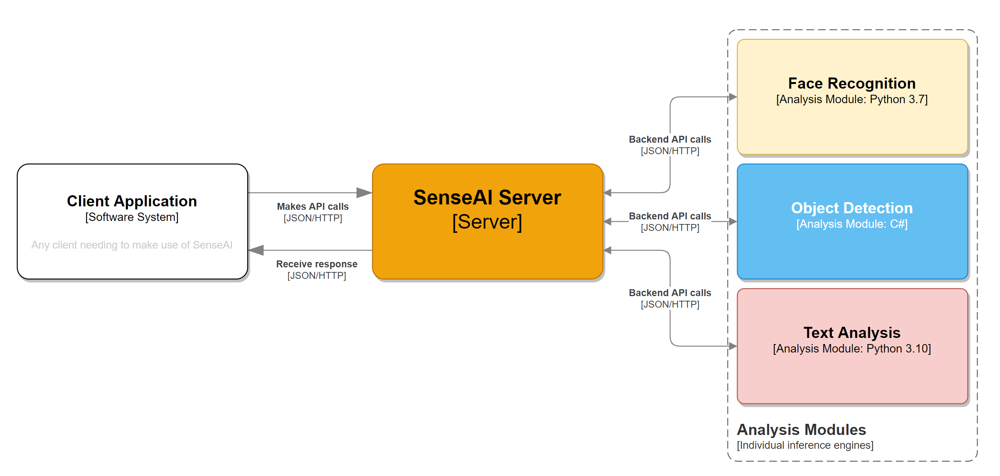
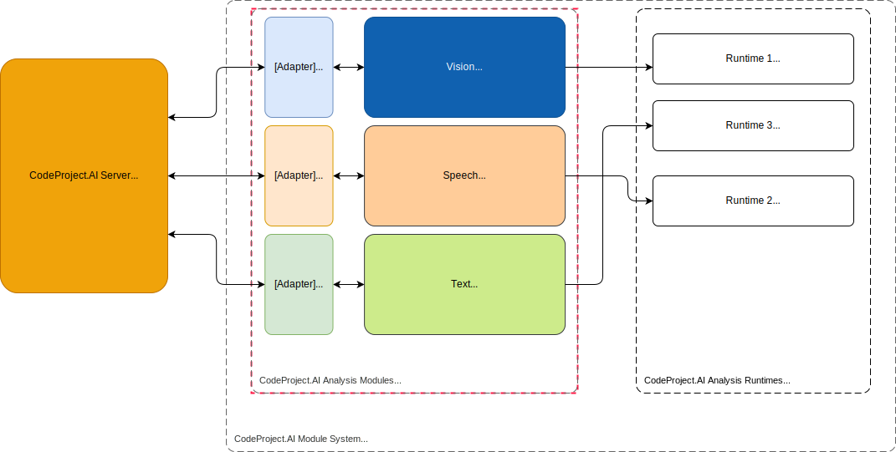

CodeProject.AI allows developers to easily add new AI functionality to an existing system 
without having to fight the tools and libraries

Adding AI capabilities to an app is reasonably straight forward if you're happy to follow the 
twisty turny maze that is the endless list of libraries, tools, interpreters, package managers and 
all the other fun stuff that sometimes makes coding about as fun as doing the dishes. 
CodeProject.AI provides a framework to manage this pain so you can focus on your code, not the tools.

## Aggregating, not adding

We say "add", but "aggregating" is more accurate. There is a *ton* of amazing AI projects out there
being actively developed and improved and we want to allow developers to take these existing,
evolving AI modules or applications and drop them into the CodeProject.AI ecosystem with as little fuss as
possible. This could mean dropping in a console application, a Python module, or a .NET project. 

For development, all you need to do is 

1. **Create an install script** (usually short) to setup the pre-requisites (download models, install 
   necessary runtimes)
2. **Write an adapter** that handles communocation between the module and the CodeProject.AI server,
3. **Provide a `modulesettings.json` file** that describes the module and provides instruction
   to CodeProject.AI on how to launch the module.

For production there are currently two further steps that are important

1. Create a Windows sub-installer for your module.
2. Update the Docker image to include your module

Both of these tasks will be covered in a future article.

## The CodeProject.AI architecture in under 30 seconds

CodeProject.AI is an HTTP based REST API server. It's basically just a webserver to which your application 
sends requests. Those requests are placed on a queue, and the analysis services (aka The Modules) 
pick requests off the queues they know how to service. Each request is then processed (an AI
operation is performed based on the request) and the results are sent back to the API server, 
which in turn sends it back to the application that made the initial call.

Suppose we had 3 analysis modules, Face recognition using Python 3.7, Object Detection using .NET, 
and Text Analysis using Python 3.10:

{width="800" .middle} 

1. An application sends a request to the API server
2. The API server places the request on the appropriate queue
3. The backend modules poll the queue they are interested in, grab a request and process it
4. The backend module then sends the result back to the API server
5. The API Server then sends the result back to the calling application

The CodeProject.AI API Server runs independently of the calling application. 

> Think of CodeProject.AI like a database server or any other service you have running in the background: 
> it runs as a service or daemon, you send it commands and it responds with results. You don't 
> sweat the details of how it goes about its business, you just focus on your application's core 
> business.

## How Modules Work

Here's a complicated diagram explaining the modules



From left to right:

1. We have the CodeProject.AI Server that starts up and monitors the analysis modules
2. We have a set of analysis modules that take requests from the CodeProject.AI Server's queues and
   process them. Each module consists of

    1. An adapter which provides the communication between the module and the CodeProject.AI server,
    2. The module itself.

3. We have a number of runtimes (eg Python or .NET) that the modules run under. Multiple modules
   can share a given runtime: we don't (yet) sandbox.
   
The adapter for each module typically runs in the same runtime (and often within the same process)
as the module, but this isn't required. You could easily write a simple Python script to act as an
adapter that sends and receives data from a .NET module.

## Setting up: models and runtimes

The setup script should take care of downloading an AI models that are needed as well as installing
any necessary runtimes. By default we currently ensure Python 3.7 and 3.9, as well as .NET 6 are 
installed and available to all. 

For Python modules the setup script would typically also ensure any Python packages are installed.

A Windows BAT file and a Linux/macOS bash file should be provided for setup, depending on which
platforms you're supporting.

## Choosing the code to add

When thinking about what modules are suitable to include in CodeProject.AI, consider the following:

 - Is the code self contained? The less baggage a module needs to drag along the better
 - Does the module provide a simple, easily callable API? For instance a Python module may provide
   a function you call, or a Go application may provide a simple console app experience that allows
   it to be called from the command line.
 - Can the module run offline? A module that requires an internet connection may simply not work
   in all envuironments, or may not be acceptable to some users who need to ensure their data stays
   within their environment
 - If the module is updated, how hard will it be to drop in the updated code? The less modifications
   you make to the original code, the easier it is to update the module later. Confine, if possible,
   your code changes to your adapter


## Writing an Adapter

The adapter for a module has one task: to shuttle communications between CodeProject.AI and the module.

An example could be a module written in Python. You have your my_module.py file that contains your
AI inference code, and within that module might be a method `predict`. The adapter would

 - Query the environment variables to know what CodeProject.AI queue it should be watching
 - Continually monitor the queue
 - Grab requests from the queue when they appear, and convert the incoming reauest into a form that
   can be passed to the module
 - Call the module (in our case, call the `predict` method in our my_module.py file).
 - Capture the response, convert it back to a format that can be sent to CodeProject.AI, and return the
   AI predictions.

If at all possible one should avoid modifying the module's code. The adapter abstracts the module
from CodeProject.AI, so if the module is updated, the updates can be dropped in and the adapter will 
(hopefully) still work. If not, adjusting the adapter to cater for a changed API, data format or
method signature should be a quick and easy fix.

## The *modulesettings.json* file

The **CodeProject.AI Server**, on startup, will load the `modulesettings.json` file
and its variants in the module's directory. The files are read by the NET Configuration system 
in the following order:

   - *modulesettings.json* - common and default configuration values
   - *modulesettings.<**production**|**development**>.json* - production or development values
   - *modulesettings.<**platform**>.json* - values specific to the runtime OS (**platform**).
     Currently supported are: `windows`, `linux`, `docker`, `macos` and `macos-arm`.
   - *modulesettings.<**platform**>.<**production**|**development**>.json* - values specific to a 
     platform and environment.

**The settings in each file will override any previously loaded settings**, allowing you to
specify, in each variant, only the settings you need to adjust for the given scenario.

### The modulesettings.json schema

The `modulesettings.json` file defines the common metadata for the module in a `Modules` section.
This metadata include information about 

  - A name and description for the module,
  - Whether it should be activated (run) at startup,
  - How the modules should be started. 
      a. Specify a `runtime` and a `filePath`. This will then launch the module specified in the
      filepath using the given runtime. Currently supported runtimes include `dotnet`, `python37`, `python38`, and `python39`. Adding more Python runtimes is trivial.
      b. Alternatively, specify a full command to run in order to start the module.
  - A list of the Platorms that the module can be run under. Currently supported include
     `windows`, `linux`, `docker`, `macos` and `macos-arm`. 
  - The name of the queue the module will process. This can be any name the module desires to use.
  - The endpoints, (`RouteMaps`),  that the **CodeProject.AI Server** will expose for this 
     module. For example the endpoint could be a GET call to `image/detect_animals`, which would 
     map to *GET: localhost:5000/v1/image/detect_animal*. The inputs and outputs
     for this endopoint are also included here, but are used solely for documentation.

An example would be

```json
{
    "Modules": {
        "PortraitFilter": {
            "Name": "Portrait Filter",
            "Activate": true,
            "Description": "Blurs the background behind people in an image.",
            "FilePath": "PortraitFilter\\PortraitFilter.dll",
            "Runtime": "dotnet",
            "Platforms": [ "windows", "linux", "docker" ],
            "RouteMaps": [
                {
                    "Name": "Portrait Filter",
                    "Path": "image/portraitfilter",
                    "Method": "GET",
                    "Queue": "portraitfilter_queue",
                    "Command": "filter",
                    "Description": "Blurs the background behind people in an image.",
                    "Inputs": [
                        {
                            "Name": "image",
                            "Type": "File",
                            "Description": "The image to be filtered."
                        },
                        {
                            "Name": "strength",
                            "Type": "Float",
                            "Description": "How much to blur the background (0.0 - 1.0).",
                            "DefaultValue: "0.5"
                        }
                    ],
                    "Outputs": [
                        {
                            "Name": "success",
                            "Type": "Boolean",
                            "Description": "True if successful."
                        },
                        {
                            "Name": "filtered_image",
                            "Type": "Base64ImageData",
                            "Description": "The filtered image."
                        }
                    ]
                }
            ]
        }
    }
}
```
