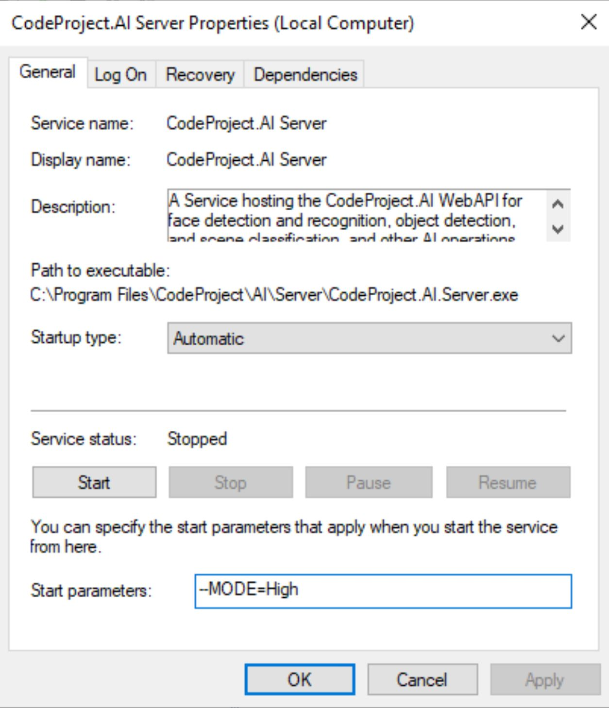

---
title: Installing CodeProject.AI Server on Windows
tags:
  - CodeProject.AI
  - Modules
  - Configuration
---

# Configuring CodeProject.AI Modules

!!! Info "This will all be made easier soon"

	Our roadmap includes providing an easy to use UI that will provide the means to ajust a module's
	settings on the fly, making this section redundant. We expect to have this complete by end of
	July 2022. 

## Windows Installation or Docker?

For a native Windows Installation you have two options to customise a module's settings:

1. Have the Windows Service manager pass settings to the module
2. Edit the modulesettings.json file directly

For those using Docker, the method to customise a module is to add extra command line arguments to
the command that launches the CodeProject.AI Docker container

### Windows Native installation

#### Using the Windows Service Manager

Open the Windows Services Manager by either

1. Click the Start button (bottom left corner of Windows) and start typing "Services". The Services
   app will appear in the search results. Open this.
2. Hit Windows Key + "r" (Command + r on a Mac keyboard) to open the Run Dialog, enter '%windir%\system32\services.msc' and hit OK

Scroll down the list of services until you find "CodeProject.AI Server". Double click this
entry to open the settings dialog.

{width="500"}

Stop the service, and in the "Start parameters" section enter the settings and values you wish to
change using the form `--setting=value`. Enter as many setting/value pairs as you wish.

#### Editing the modulesettings files

!!! Warning "Proceed with caution"

	While configuring modules is very straightforward, if you make a mistake
	you may cause a module to no longer function correctly. Always make a backup of any files you
	modify just in case you need to undo your changes.

The modules included with CodeProject.AI are configued via the `modulesettings.json` files in the module's
directory, typically located at `C:\Program Files\CodeProject\AI\AnalysisLayer\<ModuleName>\modulesettings.json`, where `ModuleName` is the name of the module.

There are variants of this file for each supported operating system, in the form
`modulesettings.<platform>.json`, where platform will be windows, macos, macos-arm, linux or docker.

To read more about the modulesettings file, please refer to the 
[developer's guide](../devguide/module_examples/adding_new_modules.md#the-modulesettingsjson-file)

To edit values simply open this file in a text editor such as Notepad or Notepad++, make your 
changes and then save the file. Please, please, please make a backup first.

### Docker

Refer to the instructions for [launching a Docker image](running_in_docker.md).

The command to run the Docker image is
``` cmd title='Command line'
docker run -p 5000:5000 --name CodeProject.AI-Server -d -v c:\ProgramData\CodeProject\AI:/usr/share/CodeProject/AI codeproject/ai-server
```

To have the Docker manager pass settings to CodeProject.AI, use the `-e setting=value` option:

``` cmd title='Command line'
docker run -e MODE=Low -p 5000:5000 --name CodeProject.AI-Server ...
```

## Settings that can be changed

### Background Remover

| Setting  | Values        | Explanation                                          |
| -------- | ------------- | ---------------------------------------------------- | 
| U2NET_HOME | A path string | The location of the AI model file. The default valaue is `%MODULES_PATH%/BackgroundRemover/models`  |

### Text Summary

| Setting  | Values        | Explanation                                          |
| -------- | ------------- | ---------------------------------------------------- | 
| NLTK_DATA | A path string | The location of the AI model file. The default valaue is `%MODULES_PATH%\\TextSummary\\nltk_data`  |

### Vision

The Vison module utilises DeepStack's vision AI modules and so shares the same settings

| Setting  | Values        | Explanation                                          |
| -------- | ------------- | ---------------------------------------------------- | 
| VISION-FACE      | True or False | Whether or not to launch the Face detection service |
| VISION-SCENE     | True or False | Whether or not to launch the Scene detection service |
| VISION-DETECTION | True or False | Whether or not to launch the object detection service |
| CUDA_MODE        | True or False | Whether or not to use the CUDA toolkit. Only available on CUDA supported hardware |
| MODE             | Low, Medium, High | Low, Medium or High resolution for the YOLO detector | 
| DATA_DIR         | Path | The path to the persistent data store directory |
| TEMP_PATH        | Path | The path to the temporary data store directory  |
| MODELS_DIR       | Path | The path to the directory containing the models |
| PROFILE          | desktop_cpu, desktop_gpu, jetson, windows_native | Not yet implemented |

### Server settings

Each module provides settings for the CodeProject.AI server itself. These settings can be modified by referencing the key
`Modules:<ModuleName>:<Setting>` where `ModuleName` is the name of the module, and `Setting` is
the name of the setting as given below

The settings that can be modified for all modules are

| Setting  | Values        | Explanation                                          |
| -------- | ------------- | ---------------------------------------------------- | 
| Activate | true or false | This sets whether or not the module will be started  |
| Runtime  | runtime       | Currently supported values are "dotnet", "python37", or "python39". Before modifying a python runtime value, ensure the version is installed in src/AnalysisLayer/bin/<platform>|
| Platform | [platform 1 , ..., platform N] | On which platforms should this module be started.Currently supported values are "windows", "linux", "macos", "macos-arm", "docker"|

For example, to ensure the TextSummary module does not start in Docker, one would run

``` cmd title='Command line'
docker run -e Modules:TextSummary:Activate=False -p 5000:5000 --name CodeProject.AI-Server ...
```

and to pass the value to the Windows Service manager directly, one would add to the start parameters `--Modules:TextSummary:Activate=False`